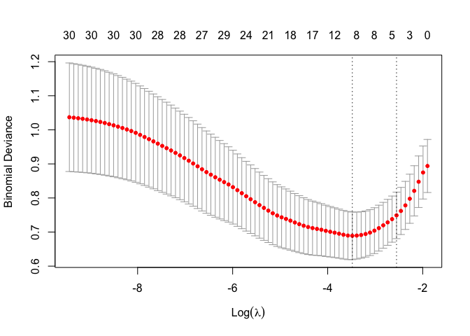
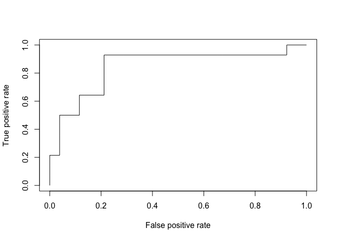

NSSI\_Longitidunal
================
Yama Chang

## Clean data for longitidunal data

``` r
## load data
baseline = read_sav('./data/baseline.sav')
baseline_v1 = read_sav('./data/baseline_v1.sav')
wave2 = read_sav('./data/wave2.sav')
wave3 = read_sav('./data/wave3.sav')

baseline = cbind(wave = 1, baseline) %>% janitor::clean_names()
baseline_v1 = cbind(baseline_v1 = 1, baseline_v1) %>% janitor::clean_names()
wave2 = cbind(wave = 2, wave2) %>% janitor::clean_names()
wave3 = cbind(wave = 3, wave3) %>% janitor::clean_names()

## merge datasets from baseline, wave2, wave3
# There are four major ways join dataframes x and y:
# Inner: keeps data that appear in both x and y
# Left: keeps data that appear in x
# Right: keeps data that appear in y
# Full: keeps data that appear in either x or y

# .x: 出現第一次
# .y: 出現第二次
# 無標記: 只出現一次/出現第三次

longitidunal_data = 
  full_join(baseline, wave2, by = "id") %>% 
  full_join(., wave3, by = "id")

longitidunal_data2 = 
  left_join(baseline, wave2, by = "id") %>% 
  left_join(., wave3, by = "id")
```

## NSSI Longitidunal Study

``` r
## Select the data we need as NSSI
# select: 選要的column
# filter: 選要的row
# drop_na: remove rows with missing value
# mutate: change columns or create new ones

NSSI = longitidunal_data %>% 
  select(id, d81.x:d106.x, birth_sex.x: meps_idi.x, d81.y:d106.y, age.y:cope14, if_ideation:d106z, age:meps_idi.y) 
```

## Clean for LASSO

``` r
library(tidyverse)
library(caret)
```

    ## Loading required package: lattice

    ## 
    ## Attaching package: 'caret'

    ## The following object is masked from 'package:purrr':
    ## 
    ##     lift

``` r
library(glmnet)
```

    ## Loading required package: Matrix

    ## 
    ## Attaching package: 'Matrix'

    ## The following objects are masked from 'package:tidyr':
    ## 
    ##     expand, pack, unpack

    ## Loaded glmnet 3.0-2

``` r
library("mice")
```

    ## 
    ## Attaching package: 'mice'

    ## The following objects are masked from 'package:base':
    ## 
    ##     cbind, rbind

``` r
## NSSI related variables in baseline
NSSI_1 = NSSI %>% 
  select(id, d91.x, d96, self_inj_year.x, d97.x, d81.x, d84.x, d87.x, d88.x, d89.x, fs.x, es.x, tis.x, ti_spride.x, ti_sshame.x, ti_salien.x, ti_spass.x, gend_dysph.x, tcs.x, safety.x, cc.x, soc_sup.x, fam_sup.x, frd_sup.x, sp_sup.x, bsi_som_t.x, bsi_dep_t.x, bsi_anx_t.x, gs_it.x, yrs_horm, if_surg.x)

## NSSI related variables in 12-month follow up
NSSI_2 = NSSI %>% 
  select(id, d91.y, self_inj_year.y, d97.y, d81.y, d84.y, d87.y, d88.y, d89.y, fs.y, es.y, tis.y, ti_spride.y, ti_sshame.y, ti_salien.y, ti_spass.y, gend_dysph.y, tcs.y, safety.y, cc.y, soc_sup.y, fam_sup.y, frd_sup.y, sp_sup.y, bsi_som_t.y, bsi_dep_t.y, bsi_anx_t.y, gs_it.y, if_surg.y)

## NSSI related variavbles in baseline & 12-month follow up
NSSI_LONG = left_join(NSSI_1, NSSI_2, by = "id")

## NSSI related variables in baseline
## outcome variable: 12-month follow up engagement in NSSI
NSSI_LASSO = NSSI %>% 
  select(id, self_inj_year.y, d91.x, d96, self_inj_year.x, d97.x, d81.x, d84.x, d87.x, d88.x, d89.x, fs.x, es.x, tis.x, ti_spride.x, ti_sshame.x, ti_salien.x, ti_spass.x, gend_dysph.x, tcs.x, safety.x, cc.x, soc_sup.x, fam_sup.x, frd_sup.x, sp_sup.x, bsi_som_t.x, bsi_dep_t.x, bsi_anx_t.x, gs_it.x, yrs_horm, if_surg.x)

## Transform predictors
# Subsitute all NA with 0
NSSI_LASSO[is.na(NSSI_LASSO)] = 0

# Transform to Y/N
NSSI_LASSO$d84.x_b = ifelse(NSSI_LASSO$d84.x >0, 1, 0)
NSSI_LASSO$d89.x_b = ifelse(NSSI_LASSO$d89.x >0, 1, 0)
NSSI_LASSO$yrs_horm_b = ifelse(NSSI_LASSO$yrs_horm >0, 1, 0)

# Transform to T/F with condition (>63)
NSSI_LASSO$bsi_som_t.x_b = ifelse(NSSI_LASSO$bsi_som_t.x >= 63, 1, 0)
NSSI_LASSO$bsi_dep_t.x_b = ifelse(NSSI_LASSO$bsi_dep_t.x >= 63, 1, 0)
NSSI_LASSO$bsi_anx_t.x_b = ifelse(NSSI_LASSO$bsi_anx_t.x >= 63, 1, 0)

# T score of 63 or higher for the GSI or a positive case for at least 2 of the subscales indicated a positive case for the GSI
NSSI_LASSO$gs_it.x_b = ifelse(NSSI_LASSO$gs_it.x >= 63, 1, 0)
NSSI_LASSO$gsi_b = ifelse(NSSI_LASSO$bsi_som_t.x_b + NSSI_LASSO$bsi_dep_t.x_b + NSSI_LASSO$bsi_anx_t.x_b >=2 | NSSI_LASSO$gs_it.x_b == 1, 1, 0)

# final dataset for LASSO analysis
NSSI_LASSO_final = NSSI_LASSO %>% select(id, self_inj_year.y, d91.x, d96, self_inj_year.x, d97.x, d81.x, d84.x_b, d87.x, d88.x, d89.x_b, fs.x, es.x, tis.x, ti_spride.x, ti_sshame.x, ti_salien.x, ti_spass.x, gend_dysph.x, tcs.x, safety.x, cc.x, soc_sup.x, fam_sup.x, frd_sup.x, sp_sup.x, bsi_som_t.x_b, bsi_dep_t.x_b, bsi_anx_t.x_b, gsi_b, yrs_horm_b, if_surg.x)
```

## LASSO preparation

``` r
# set seeds for reproducibility
set.seed(123)

# Split the data into training and test set
train_sample = NSSI_LASSO_final$self_inj_year.y %>% 
  createDataPartition(p = 0.8, list = FALSE)

train = NSSI_LASSO_final[train_sample, ]
test = NSSI_LASSO_final[-train_sample, ]

# Dumy code categorical predictor variables
#  model.matrix() helps to create the matrix of predictors and also automatically converts categorical predictors to appropriate dummy variables, which is required for the glmnet() function.

x = model.matrix(self_inj_year.y ~ ., train)[,-1]

# Convert the outcome (class) to a numerical variable

y = as.numeric(train$self_inj_year.y)
```

## Fit the lasso penalized regression model

``` r
library(glmnet)
# Find the best lambda using cross-validation
# Find the optimal value of lambda that minimizes the cross-validation error:
set.seed(123) 
cv_lasso = cv.glmnet(x, y, alpha = 1, family = "binomial")
plot(cv_lasso)
```

<!-- -->

``` r
cv_lasso$lambda.min
```

    ## [1] 0.03075171

``` r
# Fit the final model on the training data
model = glmnet(x, y, alpha = 1, family = "binomial", lambda = cv_lasso$lambda.min)

# Display regression coefficients
coef(model)
```

    ## 32 x 1 sparse Matrix of class "dgCMatrix"
    ##                           s0
    ## (Intercept)     -0.938893858
    ## id               .          
    ## d91.x            .          
    ## d96              .          
    ## self_inj_year.x  0.620863179
    ## d97.x            0.002648944
    ## d81.x            .          
    ## d84.x_b          0.861224315
    ## d87.x            .          
    ## d88.x            .          
    ## d89.x_b          .          
    ## fs.x             .          
    ## es.x             0.067687259
    ## tis.x            .          
    ## ti_spride.x      .          
    ## ti_sshame.x      .          
    ## ti_salien.x      .          
    ## ti_spass.x       .          
    ## gend_dysph.x     .          
    ## tcs.x            .          
    ## safety.x        -0.810703195
    ## cc.x             .          
    ## soc_sup.x        .          
    ## fam_sup.x        .          
    ## frd_sup.x        .          
    ## sp_sup.x         .          
    ## bsi_som_t.x_b    0.180433149
    ## bsi_dep_t.x_b    .          
    ## bsi_anx_t.x_b    0.183381168
    ## gsi_b            0.128363473
    ## yrs_horm_b       .          
    ## if_surg.x        .

``` r
# Make predictions on the test data
x_test = model.matrix(self_inj_year.y ~ ., test)[,-1]
probabilities = model %>% predict(newx = x_test)
predicted.classes = ifelse(probabilities > 0.5, "1", "0")

# Model accuracy
observed.classes = test$self_inj_year.y
mean(predicted.classes == observed.classes)
```

    ## [1] 0.8181818

## Notes

``` r
# Find the optimal value of lambda that minimizes the cross-validation error
# The plot displays the cross-validation error according to the log of lambda. The left dashed vertical line indicates that the log of the optimal value of lambda is approximately -5, which is the one that minimizes the prediction error. This lambda value will give the most accurate model. The exact value of lambda can be viewed as follow

set.seed(123) 
cv_lasso = cv.glmnet(x, y, alpha = 1, family = "binomial")
plot(cv_lasso)
```

<!-- -->

``` r
cv_lasso$lambda.min
```

    ## [1] 0.03075171

``` r
# Using lambda.min as the best lambda, gives the following regression coefficients
coef(cv_lasso, cv_lasso$lambda.min)
```

    ## 32 x 1 sparse Matrix of class "dgCMatrix"
    ##                            1
    ## (Intercept)     -0.939022076
    ## id               .          
    ## d91.x            .          
    ## d96              .          
    ## self_inj_year.x  0.620979398
    ## d97.x            0.002649186
    ## d81.x            .          
    ## d84.x_b          0.861200085
    ## d87.x            .          
    ## d88.x            .          
    ## d89.x_b          .          
    ## fs.x             .          
    ## es.x             0.067695893
    ## tis.x            .          
    ## ti_spride.x      .          
    ## ti_sshame.x      .          
    ## ti_salien.x      .          
    ## ti_spass.x       .          
    ## gend_dysph.x     .          
    ## tcs.x            .          
    ## safety.x        -0.810649111
    ## cc.x             .          
    ## soc_sup.x        .          
    ## fam_sup.x        .          
    ## frd_sup.x        .          
    ## sp_sup.x         .          
    ## bsi_som_t.x_b    0.180352949
    ## bsi_dep_t.x_b    .          
    ## bsi_anx_t.x_b    0.183261058
    ## gsi_b            0.128457582
    ## yrs_horm_b       .          
    ## if_surg.x        .

``` r
# Using lambda.1se as the best lambda, gives the following regression coefficients
coef(cv_lasso, cv_lasso$lambda.1se)
```

    ## 32 x 1 sparse Matrix of class "dgCMatrix"
    ##                            1
    ## (Intercept)     -0.702959697
    ## id               .          
    ## d91.x            .          
    ## d96              .          
    ## self_inj_year.x  0.453588935
    ## d97.x            .          
    ## d81.x            .          
    ## d84.x_b          0.470644795
    ## d87.x            .          
    ## d88.x            .          
    ## d89.x_b          .          
    ## fs.x             .          
    ## es.x             .          
    ## tis.x            .          
    ## ti_spride.x      .          
    ## ti_sshame.x      .          
    ## ti_salien.x      .          
    ## ti_spass.x       .          
    ## gend_dysph.x     .          
    ## tcs.x            .          
    ## safety.x        -0.564872576
    ## cc.x             .          
    ## soc_sup.x        .          
    ## fam_sup.x        .          
    ## frd_sup.x        .          
    ## sp_sup.x         .          
    ## bsi_som_t.x_b    .          
    ## bsi_dep_t.x_b    .          
    ## bsi_anx_t.x_b    .          
    ## gsi_b            0.009067167
    ## yrs_horm_b       .          
    ## if_surg.x        .

``` r
# Setting lambda = lambda.1se produces a simpler model compared to lambda.min, but the model might be a little bit less accurate than the one obtained with lambda.min.
```

# Plot correlation

``` r
# install.packages("GGally")
# install.packages("ggcorrplot")
library("GGally")
```

    ## Registered S3 method overwritten by 'GGally':
    ##   method from   
    ##   +.gg   ggplot2

    ## 
    ## Attaching package: 'GGally'

    ## The following object is masked from 'package:dplyr':
    ## 
    ##     nasa

``` r
library(ggcorrplot)

# GGally
corr_plot_a = ggcorr(NSSI_LASSO_final,
       label = TRUE, 
       label_alpha = FALSE,
       digits = 2,
       label_size = 1,
       geom = "tile",
       palette = "PuOr")

corr_plot_a
```

<!-- -->

``` r
corr = round(cor(NSSI_LASSO_final), 1)
p = cor_pmat(NSSI_LASSO_final)


corr_plopt_b = ggcorrplot(corr, hc.order = TRUE, type = "lower",
   lab = TRUE, 
   lab_size = 2,
   outline.col = "white",
   ggtheme = ggplot2::theme_gray,
   colors = c("#6D9EC1", "white", "#E46726"),
   legend.title = "Correlation",
   title = "Correlation of predictors")

ggsave("correlation.png", corr_plopt_b)
```

    ## Saving 7 x 5 in image

``` r
corr_plopt_c = ggcorrplot(corr, p.mat = p, hc.order = TRUE,
    type = "lower",
    lab = TRUE, 
    lab_size = 2,
    outline.col = "white",
    ggtheme = ggplot2::theme_gray,
    colors = c("#6D9EC1", "white", "#E46726"),
    legend.title = "Correlation",
    title = "Correlation of predictors"
    ) + labs(caption="X = correlation non-significant at p < 0.05")
    
ggsave("correlation_c.png", corr_plopt_c, dpi = 300)
```

    ## Saving 7 x 5 in image
